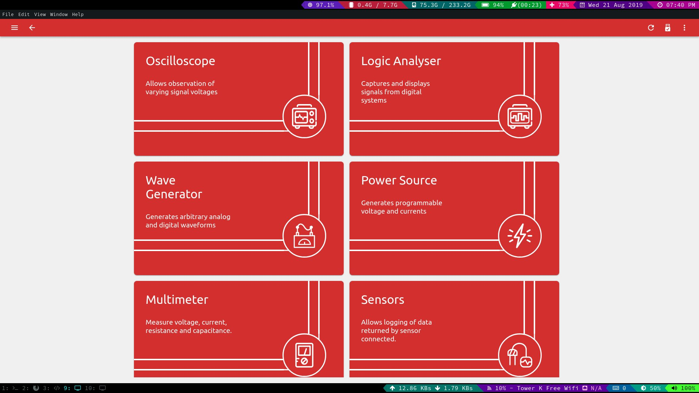

# PSLab Experiments

Here you find step by step instructions for Pocket Science Lab (PSLab) using the PSLab hardware and Android app. Please help by building up this website.

## How to use PSLab Instruments on Android

- To use any feature of the PSLab Android application first follow these 2 steps:

  1. Connect PSLab board with your Android smartphone using OTG cable
  2. Open <a href="https://play.google.com/store/apps/details?id=io.pslab">PSLab Android application</a>

* How to use the PSLab Oscilloscope?

  1. Connect SI1 and SI2 pins on PSLab board to CH1 and CH2 pins respectively for Analog mode or connect SQ1,SQ2,SQ3 pins to CH1, CH2, CH3 pins respectively for Digital mode.
  2. Go to Wave Generator instrument in the PSLab Android application.
  3. Select either Digital or Analog mode.
  4. Set desired frequency, phase and duty(in case of Digital mode) values for Wave1 and Wave2 (Analog mode) or SQ1,SQ2,SQ3 (Digital mode).
  5. Exit from Wave Generator instrument and got to Oscilloscope instrument in PSLab Android application.
  6. Select either or all from the CH1, CH2, CH3 checkbox to see waves generated at each channel.
  7. Change timebase of the waves from the Trigger and Timebase section on the left control panel.
  8. Plot waves against each other from the XY-Plot section on the left control panel.
  9. View results of Fourier transform or curve fitting from the Data Analysis section on the left control panel.
  10. Use in built microphone of the smartphone as input select IN-BUILT MIC option on the bottom panel on the main screen.
  11. Use record button to record currently generated waves and store the data in a CSV file and play it back at will.

* How to use the PSLab Multimeter?
* How to use the PSLab Wavelength Generator?

## How to use PSLab Instruments on Desktop

- To use any feature of the PSLab Android application first follow these 2 steps:

  1. Connect PSLab board with your Desktop using USB cable
  2. Open <a href="https://github.com/fossasia/pslab-desktop">PSLab Desktop application</a>

You will be presented with a home screen like this.  
  

  
Click on the instrument you would like to use.

### 1. Oscilloscope

An instrument used to measure voltage changes over a period of time in real time.

##### GUI description
  

  1. Options used to select the active channels and the range of measurement.
  2. Timebase adjustments and trigger options.
  3. Fourier analysis and sin/squre fitting options.
  4. XY plotting settings.
  5. Graph area.
  6. Record button.

##### Basic Usage
  * Connect CH1, CH2, CH3 and MIC to any available volatage source that you would want to monitor. Jumper cables will be recommended for making the connections.
  * For quick experiment, you can connect the pins to S1, S2 to observe Sine waves **( optional step )**
  * Select the voltage range and timebase accordingly to plot the voltage vs time graph properly.
  * Once the voltage vs time graph starts getting captured, set the trigger accordginly to get a stable graph.
  * You can now apply fourier analyis on the signal to get more information about the graph.
  * If the signal is a Sine wave or a Square wave, you can apply Sine / Square fitting to get parameter values like Frequency, Amplitude, etc.
  * While monitoring more than one signal at once, you can apply XY plotting option to plot once signal with respect to other.
  * You can click on the record option to write the observed values to a CSV file for playing it back later on the Android / Desktop app.

## Experiments

* Do you want to measure your body resistance?
* Do you want to see brain waves?
* Which one generates electricity; an Apple or a Lime?
* Do you want to flickr an LED?
* Do you want to find where the main power lines run in your house?
* Who has the highest pitch (Female or Male)?
* How wet surfaces conduct electricity and why you should not touch any wires if the floor is wet?
* What’s the lowest frequency you can hear?
* What’s the highest frequency you can hear?
* Can you make a capacitor at home?
* Do you want to see if you bought a new battery or a used one?
* How much noise does school bell make?

## Template for Experiments

Please help to contribute more step by step tutorials for experiments. Please use the [experiment template](template-howto) to get started.
