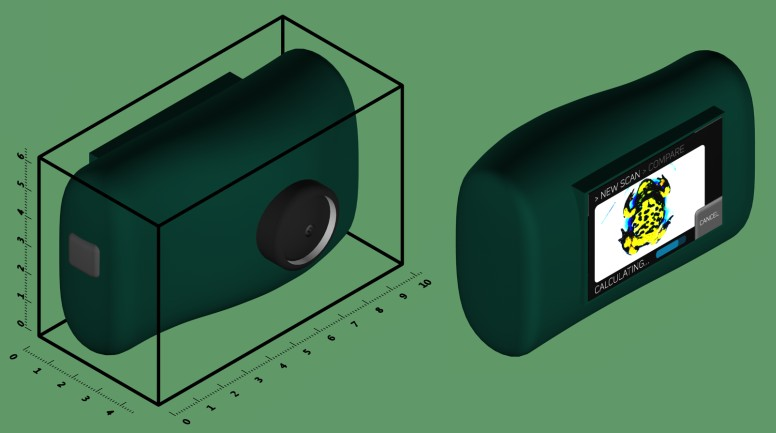
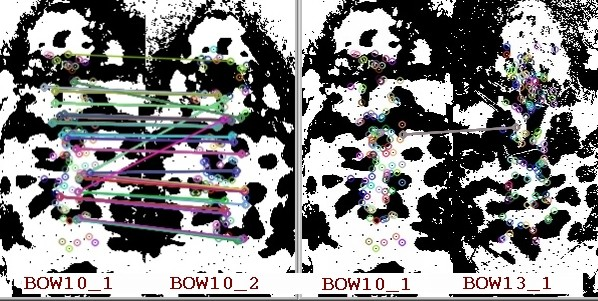
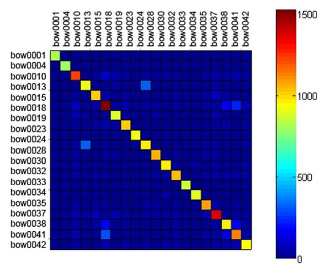

# PSLab Imaging AI

Computer Vision Based Individual Animal Recognition. Identify and classify animals, live using AI.

PSLab Imaging is a software that lets you take photos of animals and analyze their unique visual patterns. Within minutes, the software is able to tell you, whether an animal of a certain species, has already been found, or if it is a new individual. Thanks to state-of-the-art computer vision algorithms, these assertions come with a very high accuracy, namely around 90-100%!

 

Visual recognition is highly efficient, that means no more invasive marking methods are required - stress may be reduced, drastically. We intend to offer PSLab Imaging AI as an online and offline solution. For offline use cases, where no Internet is available we are also working on PSLab Imaging AI hardware using standard components.

## COMMUNICATIONS

Our website is at http://pslab.fossasia.org

Please join the chat channel at https://gitter.im/fossasia/pslab

## ROADMAP

PSLab Imaging AI will be shipped along with the software, that will hold the following key functions:
* Take a photo of an individual animal, including fully automatic image quality check
* Run analysis and compare new individual with individuals in the local database
* Let the software assert, whether the individual is new or already exists (match)
* Manage database entries, add descriptions and export

How does it work? PSLab Imaging AI makes use of modern approaches from the field of computer vision, including image description and clustering algorithms. The result so far already delivers outstanding classification accuracies. For large-scale animal databases, machine learning algorithms may be utilized.

 
figure: comparison example with yellow-bellied toads, visualizing good keypoint matches. On the left: Two images of the same individual. On the right: Different individuals.

Unlike the figure suggests, the photos do not necessarily have to be aligned or cropped - the software does it! Photos are being pre-processed, and the description of patterns is rotational invariant. The only thing you have to do is to take the picture.

 
figure: feature cross-correlation within a test data set of yellow-bellied toads. Same individuals match with very high significance, while unequal individuals deliver only a few good matches.

## LICENSE

The repo is licensed under GNU General Public License v3.0.

## CONTACTS
Falk Eckhardt, M.Sc., Biology 

Willi Döring, M.Sc., Software Development Lead 

Maria Goltsova, M.Sc., Software Development

Mario Behling, M.A., Project Management
