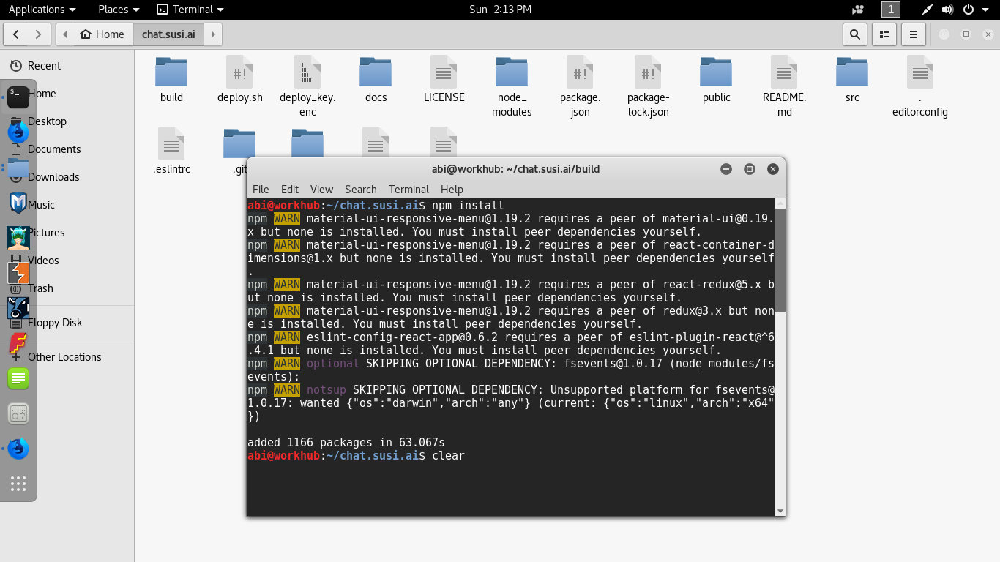
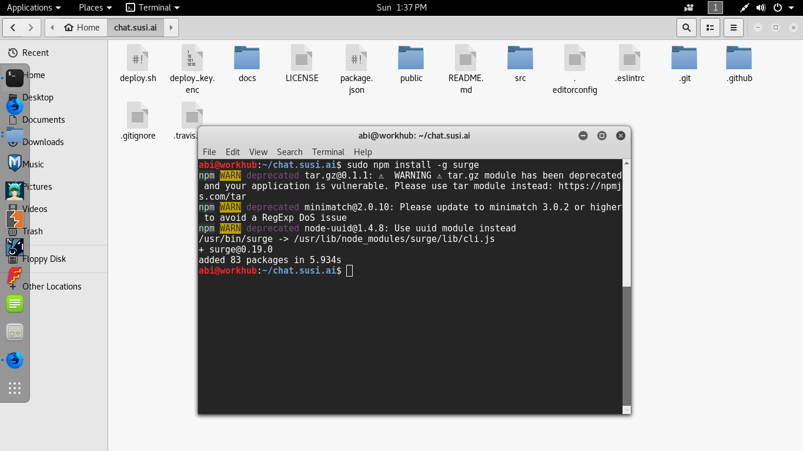
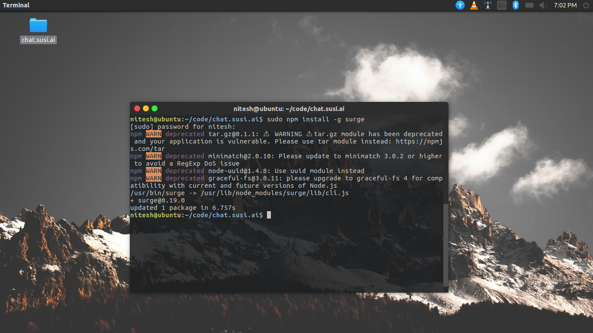
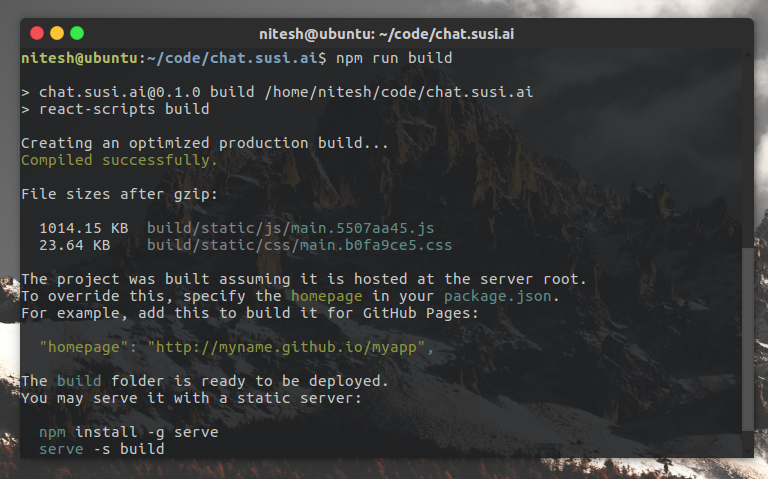
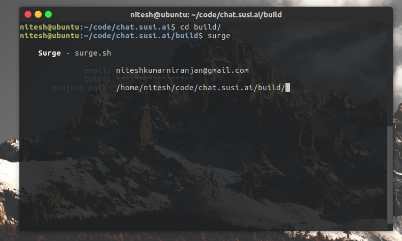

# সার্জের সাথে ডিফল্ট করা

* ওয়েবসাইট: [Surge.sh](https://surge.sh/)
* সরাতে স্থাপনার সময় একটি নমুনা কনসোল আউটপুট দেখতে এই ভিডিওটি অনুসরণ করুন: https://asciinema.org/a/150690

## পদক্ষেপ 1: * **একটি উত্পাদন তৈরি করুন:**

* `npm run build`

আউটপুট: * (নমুনা) *

> chat.susi.ai@0.1.0 build C:\FOSSASIA\chat.susi.ai
    > react-scripts build
    
    Creating an optimized production build...
    Compiled successfully.
    
    File sizes after gzip:
    
      1011.99 KB  build\static\js\main.2660cfa3.js
      23.64 KB    build\static\css\main.7cf93e8b.css
    
    The project was built assuming it is hosted at the server root.
    To override this, specify the homepage in your package.json.
    For example, add this to build it for GitHub Pages:
    
      "homepage": "http://myname.github.io/myapp",
    
    The build folder is ready to be deployed.
    You may serve it with a static server:
    
      npm install -g serve
      serve -s build

## পদক্ষেপ 2: সার্জ ইনস্টল করুন

* `npm install -g surge`

    npm WARN deprecated tar.gz@0.1.1: â ï¸  WARNING â ï¸ (...)
    npm WARN deprecated minimatch@2.0.10: Please update to minimatch 3.0.2 or higher to avoid a RegExp DoS issue
    npm WARN deprecated node-uuid@1.4.8: Use uuid module instead
    C:\Users\*\AppData\Roaming\npm\surge -> C:\Users\*\AppData\Roaming\npm\node_modules\surge\lib\cli.js
    C:\Users\*\AppData\Roaming\npm
    `-- surge@0.19.0
      +-- du@0.1.0
      | `-- async@0.1.22
      +-- fstream-ignore@1.0.2
      | +-- fstream@1.0.11
      | | +-- graceful-fs@4.1.11
      | | +-- mkdirp@0.5.1
      | | | `-- minimist@0.0.8
      | | `-- rimraf@2.6.2
      | |   `-- glob@7.1.2
      | |     +-- fs.realpath@1.0.0
      | |     +-- inflight@1.0.6
      | |     | `-- wrappy@1.0.2
      | |     +-- minimatch@3.0.4
      | |     +-- once@1.4.0
      | |     `-- path-is-absolute@1.0.1
      | +-- inherits@2.0.3
      | `-- minimatch@2.0.10
      |   `-- brace-expansion@1.1.8
      |     +-- balanced-match@1.0.0
      |     `-- concat-map@0.0.1
      +-- is-domain@0.0.1
      +-- minimist@1.1.1
      +-- moniker@0.1.2
      +-- netrc@0.1.4
      +-- progress@1.1.8
      .
      .
      (blah)
      (blah)
      .
      .
      +-- surge-ignore@0.2.0
      +-- tar@1.0.0
      | `-- block-stream@0.0.9
      +-- tar.gz@0.1.1
      | +-- commander@1.1.1
      | | `-- keypress@0.1.0
      | +-- fstream@0.1.31
      | | `-- graceful-fs@3.0.11
      | |   `-- natives@1.1.0
      | `-- tar@0.1.20
      `-- url-parse-as-address@1.0.0

## পদক্ষেপ 3: সার্জ সঙ্গে কনফিগার এবং স্থাপনার!

`sudo npm install -g surge`

`npm run build`

`cd build\`

`surge`

এবং বিবরণ আপনি লিখুন

আউটপুট: * (নমুনা) *

 Surge - surge.sh
    
                  email: contact@0x48piraj.co
                  token: *****************
           project path: C:\FOSSASIA\chat.susi.ai\build\
                   size: 58 files, 31.0 MB
                 domain: sophisticated-reason.surge.sh
    
    
                   plan: Free
                  users: contact@0x48piraj.co
             IP Address: 45._5._10.___
    
        Success! Project is published and running at sophisticated-reason.surge.sh
