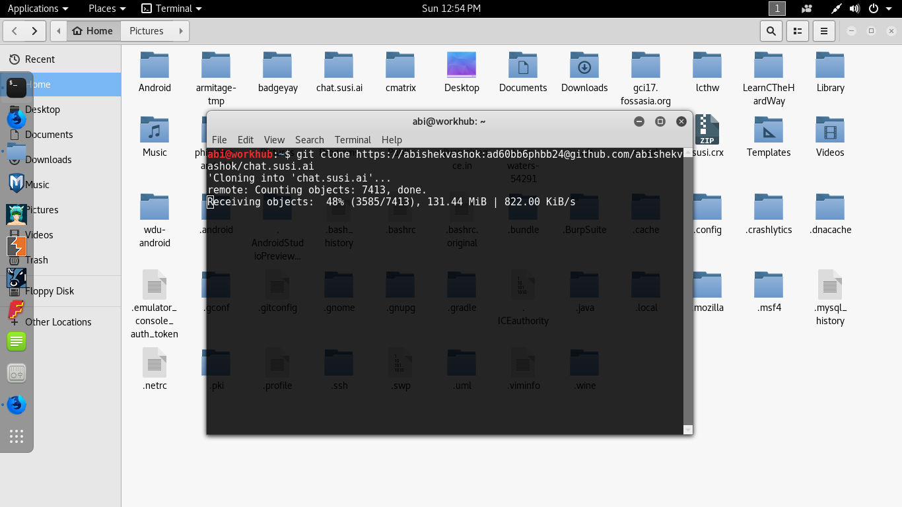
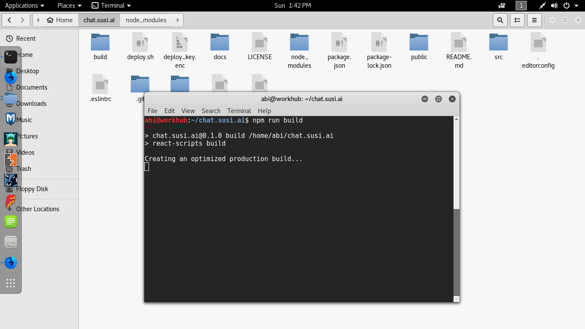
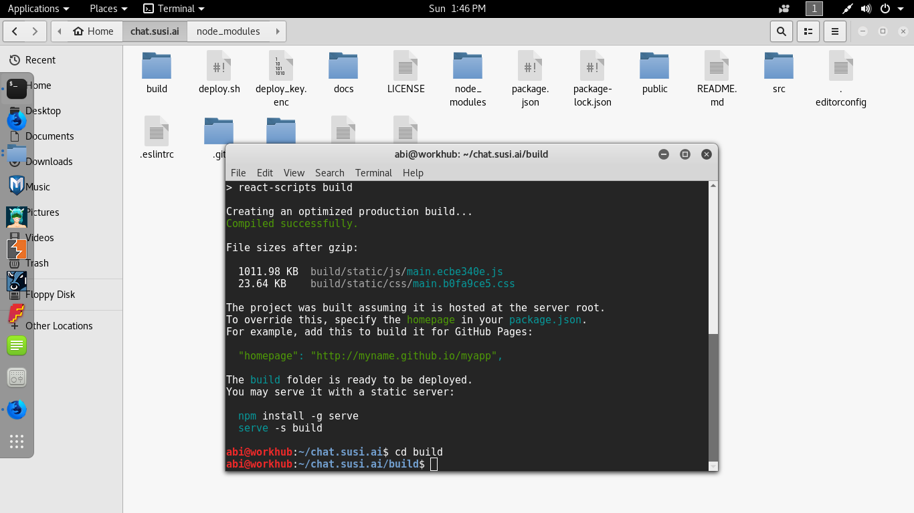
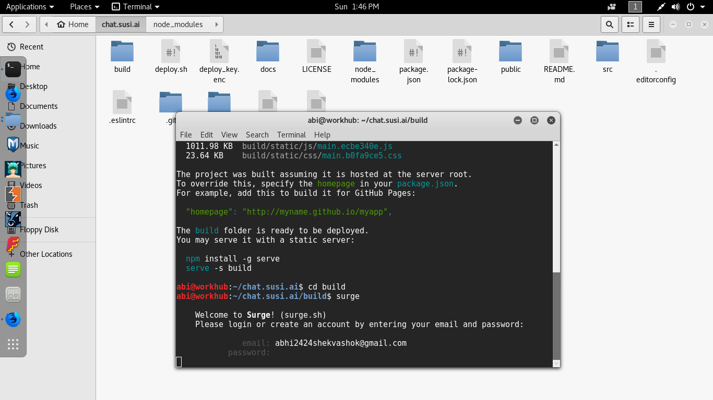
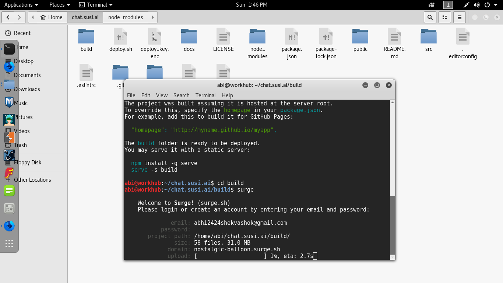
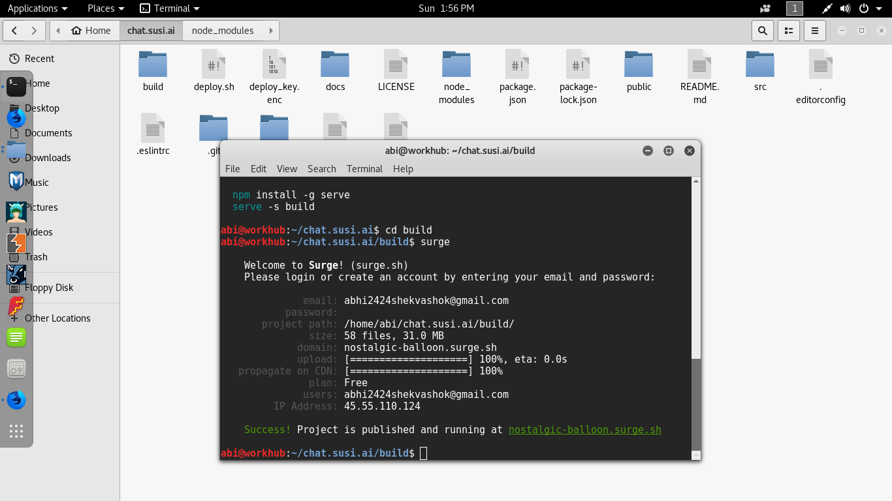
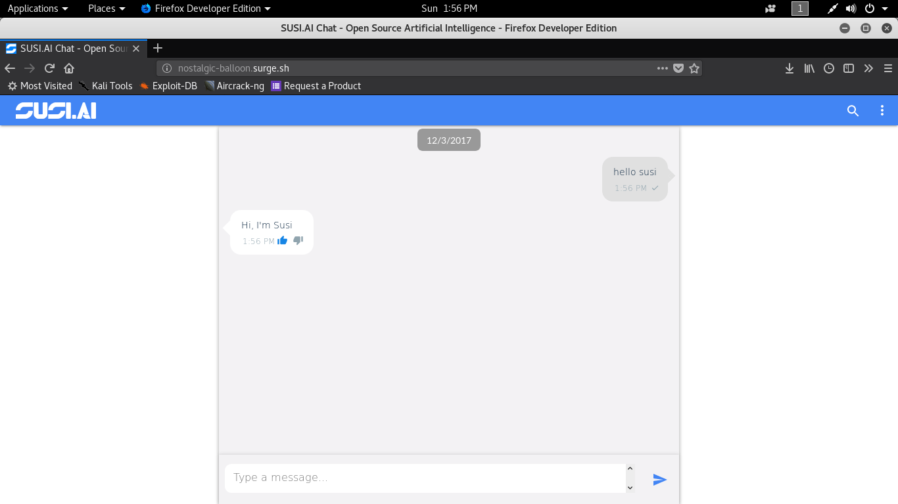

# Deploy chat.susi.ai to surge

Surge is a static web publishing service through which we can publish websites quite easily.
To deploy chat.susi.ai to surge, please do the following steps:

* **Step 1:** If you don't have node and npm install nodejs
* **Step 2:** Install Surge:
```
  npm install -g surge
```


* **Step 2:** Clone chat.susi.ai and cd into the repo
```
  git clone https://github.com/fossasia/chat.susi.ai
  cd chat.susi.ai
```


* **Step 3:** Install the dependecies:
```
  npm install
```


* **Step 4:** Run the App build:
```
  npm run build
```


* **Step 5:** Switch into the build directory:
```
cd build
```


* **Step 6:** Run surge:
```
surge
```


* **Step 7:** Follow the prompts and provide an email, password and optionally the new site's domain.




* **Step 8:** Go to URL that appears after the above process for testing your Changes.

