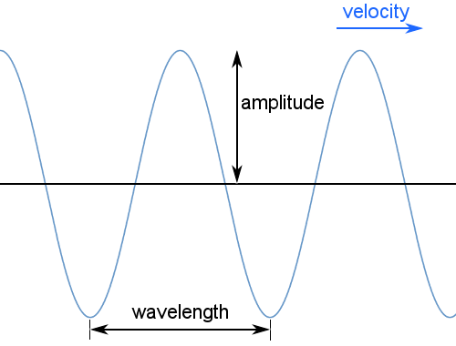

Wave Generator
==============

Introduction to Waves
---------------------

A wave is a physical phenomenon characterized by its frequency, wavelength, and amplitude.
In general, waves transfer energy from one location to another, in which case they have a velocity.

Standing waves may also occur; these have no net velocity and involve no net transfer of energy. They have frequency,
wavelength and amplitude.
Mechanical waves require a medium to travel through: for example, sound waves and earthquake waves cannot travel 
through a vacuum.
Electromagnetic waves, such as light, do not require a medium and can travel through a vacuum.
Transverse waves, such as light, oscillate perpendicular to the direction the wave is carrying energy as in the
diagram above. Longitudinal waves, such as sound, oscillate parallel to the direction of energy transfer.

How to use the Wave Generator
-----------------------------

> 1.  Connect SI1 and SI2 pins on PSLab board to CH1 and CH2 pins
>     respectively for Analog mode or connect SQ1,SQ2,SQ3 pins to CH1,
>     CH2, CH3 pins respectively for Digital mode.
> 2.  Go to Wave Generator instrument in the PSLab Android application.
> 3.  Select either Digital or Analog mode.
> 4.  Set desired frequency, phase and duty(in case of Digital mode)
>     values for Wave1 and Wave2 (Analog mode) or SQ1,SQ2,SQ3 (Digital
>     mode).
> 5.  Select either sine or triangular wave shape for SI1 and SI2 in
>     analog mode.
> 6.  Use Play button to directly view set waves in Oscilloscope or
>     Logical Analyzer
> 7.  Use Save button to save the set wave configs and use these configs
>     later.

<table>
     <tr>
         <td></td>
         <td></td>
     </tr>
 </table>

Experiment: Generate Sounds with Waves
--------------------------------------

- Experiment video on Youtube:
[Using Wave Generator In PSLab Android App to produce different waveforms | FOSSASIA | GSoC'18
](https://www.youtube.com/watch?v=NC2T5kElWbE)

Experiment: Blinking LEDs with the wave generator
-------------------------------------------------
